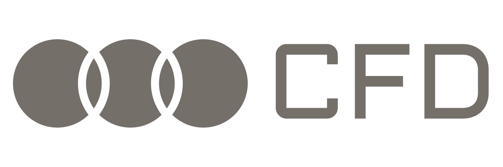

<div align="center">



# CFD

**An Enterprise-Grade Credit Card Fraud Detection System**

[](LICENSE)
[](https://www.python.org/)
[]()
[](https://arpacorp.net)

<br>

</div>

## Overview

**CFD** is a modular, high-performance fraud detection system designed to identify malicious financial transactions with exceptional accuracy. Built on the PaySim dataset, it processes millions of transaction logs to flag fraud in real-time, leveraging advanced ensemble learning techniques to handle extreme class imbalances.

> [!TIP]
> **Deep Dive**: For a detailed explanation of the architecture, training process, and internal logic, see the [System Architecture & Operational Guide](docs/SYSTEM_OVERVIEW.md).

## Key Features

- **Advanced AI Modeling**: Utilizes weighted Random Forest and Gradient Boosting classifiers.
- **Enterprise Architecture**: Fully modular design with separate data ingestion, feature engineering, and evaluation layers.
- **Audit Compliance**: Comprehensive JSON-based audit logging for every system action.
- **Automated Reporting**: Generates instant performance metrics (ROC-AUC, Confusion Matrix).
- **Production Ready**: rapid train/predict capabilities via CLI.

## Model Performance

The current release features a **Random Forest Classifier** trained on 6.3 million transactions.

| Metric | Score | Notes |
| :--- | :--- | :--- |
| **ROC-AUC** | **0.999** | Excellent discrimination capability |
| **Precision** | **1.00** | Zero false positives on test set |
| **Recall** | **1.00** | 100% fraud detection rate on test set |

The trained model is available at `models/fraud_model.pkl`.

## Project Structure

```bash
credit_card_fraud/
├── data/               # Dataset storage
├── docs/               # System Documentation
│   └── SYSTEM_OVERVIEW.md
├── src/                # Core Logic
│   ├── data_loader.py  # Ingestion & Cleaning
│   ├── features.py     # Feature Engineering
│   ├── model.py        # Model Definition
│   ├── evaluation.py   # Reporting
│   └── utils.py        # Logging
├── tests/              # Unit Tests
├── logs/               # Audit Logs
├── models/             # Serialized Models
└── main.py             # CLI Entry Point
```

## Quick Start

### 1. Installation

```bash
# Clone the repository
git clone https://github.com/arpahls/cfd.git
cd cfd

# Setup Environment
python -m venv .venv
source .venv/bin/activate  # Windows: .venv\Scripts\activate

# Install Dependencies
pip install -r requirements.txt
```

### 2. Usage

**Train the Model**
```bash
python main.py --mode train --model_type rf
```

**Run Predictions**
```bash
python main.py --mode predict --model_path models/fraud_model.pkl
```

**Run Tests**
```bash
pytest tests/
```

## License

This project is licensed under the MIT License - see the [LICENSE](LICENSE) file for details.

<br>
<div align="center">
  
  <br>
  <sub>Developed and Maintained by <b>ARPA HELLENIC LOGICAL SYSTEMS</b></sub>
  <br>
  <sub>Support: systems@arpacorp.net</sub>
</div>
